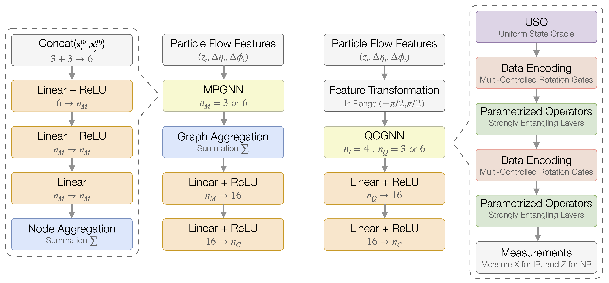

# Jet Discrimination with Quantum Complete Graph Neural Network 

[](https://doi.org/10.5281/zenodo.14504715)


This repository contains the source code for the paper [arXiv:2403.04990](https://arxiv.org/abs/2403.04990). The primary script for training the models is located in `main.ipynb`, with supplementary modules available in the `source/` directory. Notebooks related to IBMQ are prefixed with 'ibmq_', and the training results using simulators can be found in `training_result.ipynb`.

---

### Installation

#### Environment Setup via `setup.py`
The primary training workflow relies on [PyTorch](https://pytorch.org) and [PennyLane](https://pennylane.ai). Python 3.9 or newer is required. To install the necessary packages, execute the following commands:

```bash
# Install using `setup.py`
pip install .

# Optional cleanup
rm -rf build QCGNN.egg-info
```

> **Note:** Ensure that the `PennyLane` version is 0.31.0 or later due to an issue with `qml.qnn.TorchLayer` (see [this discussion](https://discuss.pennylane.ai/t/inputs-dimension-mix-with-batch-dimension-in-qml-qnn-torchlayer/3824/8) for more details).

#### Jupyter Environment (Optional)
Most of the Python scripts are written in [Jupyter Notebook](https://jupyter.org) format (`.ipynb`). If you prefer to run them as traditional Python scripts (`.py`), you can convert the notebooks using the `ipynb-py-convert` package:

```bash
# Convert notebook to Python script
pip install ipynb-py-convert
ipynb-py-convert some_notebook_file.ipynb to_py_file.py
python to_py_file.py
```

---

### Datasets

The feasibility of each model is demonstrated using two different Monte Carlo datasets, both containing particle flow information of fatjets (R = 0.8) initiated by different particles. The datasets can be downloaded from the following sources:

- **[JetNet Dataset](https://zenodo.org/records/6975118):** This dataset is used for the multi-class classification task, featuring fatjets with roughly 1 TeV transverse momentum originating from gluons, light quarks, top quarks, W bosons, and Z bosons. For more details, refer to [arXiv:2106.11535](https://arxiv.org/abs/2106.11535). **Place the downloaded `hdf5` files in the `dataset/jetnet` directory.**

- **[Top Quark Tagging Dataset](https://zenodo.org/records/2603256):** This dataset is used for the binary classification task, with fatjet momentum in the range [550, 650] GeV. **Place the downloaded `hdf5` files in the `dataset/top` directory, and rename `val.h5` to `valid.h5`.**

---

### Models

The workflow of MPGNN and QCGNN is given by the following figure. For details, see Section III B of the paper.


The QCGNN model is implemented using `PennyLane` within the `PyTorch` framework, and can be found in `source/models/qcgnn.py`. The classical benchmarking models include:

- **[Particle Flow Network (PFN)](https://arxiv.org/abs/1810.05165):** A message-passing-based complete graph neural network.

- **[Particle Transformer (ParT)](https://arxiv.org/abs/2202.03772):** A transformer-based model, incorporating interaction features as residual values in attention masks.

- **[Particle Network (PNet)](https://arxiv.org/abs/1902.08570):** A dynamic graph convolutional neural network (DGCNN) model, with edges defined in latent space.

### Pretrained Checkpoints and Training Logs

Pretrained checkpoints and training logs for each model are available in the `training_logs` folder on [Google Drive - QCGNN](https://drive.google.com/drive/folders/1cY__Pj9Rf2n7a8ErMRzOcIppd40MWIEC?usp=sharing). We use Wandb for monitoring the training process, so the main training logs are stored in `training_logs/WanbdLogger`. To run `training_result.ipynb`, ensure the `training_logs` directory is located at the cloned repository.

### IBMQ Results

The results of experiments conducted on IBMQ quantum computers, including metrics such as AUC and accuracy, are stored in the `ibmq_result` folder on [Google Drive - QCGNN](https://drive.google.com/drive/folders/1cY__Pj9Rf2n7a8ErMRzOcIppd40MWIEC?usp=sharing). The calibrations of the QPUs we used are provided in the CSV files at `ibmq_result`.

- **`ibmq_result/time_complexity`:** Output of `ibmq_time_complexity.ipynb`, which measures the time required to operate quantum gates.
- **`ibmq_result/pretrained`:** Output of `ibmq_pretrained.ipynb`, which evaluates the performance of the pretrained QCGNN (trained using simulators) on actual IBMQ quantum devices.
- **`ibmq_result/noise`:** Output of `ibmq_noise.ipynb`, detailing metrics when executing QCGNN simulators with varying noise levels.

---

### Acknowledgements

The *Particle Transformer (ParT)* and *Particle Net (PNet)* models were provided by [You-Ying Li](https://github.com/youyingli) and [Zheng-Gang Chen](https://github.com/ZhengGang85129). They were adapted from [Particle Transformer for Jet Tagging](https://github.com/jet-universe/particle_transformer) and [ParticleNet: Jet Tagging via Particle Clouds](https://github.com/hqucms/ParticleNet), respectively.